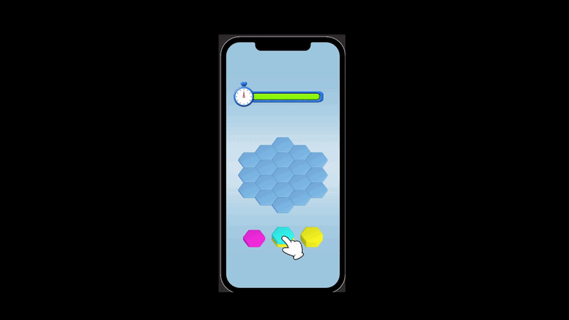

# 🛑 Hexa Sort Playable Ad (Luna Playworks Test)

## 🎮 About the Project
This repository contains a **Playable Ad** built with Unity and ported to WebGL using the **Luna Playworks** engine. The project was developed as a technical test task to demonstrate the ability to create lightweight, highly optimized, and engaging mini-games for ad networks (ironSource, AppLovin, Unity Ads, etc.).

### 🌟 Core Features
- **Hexa Sort Mechanics:** A satisfying puzzle where the player drags stacks of colored hexagons onto a grid to merge them.
- **Juicy Animations:** Smooth chip movement, bouncing, merging, and UI effects implemented via `LeanTween`.
- **Interactive Tutorial:** A hand animation that automatically appears if the player is idle (AFK) to guide their next move.
- **Packshot:** A final Call to Action (CTA) screen with a pulsating button, appearing smoothly after game completion or when the timer runs out.

## 🛠 Technical Details
- **Engine:** Unity
- **Build Framework:** Luna Playworks (Creative Library)
- **Architecture & Code:** Clean, loosely coupled C# code (separated into `MergeManager`, `StackController`, `PackshotManager`, etc.). A strict unified coding style is maintained throughout the project (e.g., `_privateFields` and `PublicFields`).

## 🚀 Luna Integration & Optimization
The project strictly adheres to ad network standards:
- **API Integration:** Essential methods for analytics and store redirection (`Luna.Unity.LifeCycle.GameEnded()` and `Luna.Unity.Playable.InstallFullGame()`) are fully implemented.
- **Size Optimization:** The final build output is aggressively optimized and weighs only **1.49 MB**, guaranteeing instant loading within mobile apps.
- **Physics Synchronization:** The code is adapted to handle Ammo.js quirks within Playworks (resolving a 1-frame physics lag issue).

## 📂 Project Structure
- `Assets/Scripts/`: Core gameplay, timer, and UI logic.
- `Assets/Prefabs/`: Optimized hex and grid prefabs.
- `Assets/LeanTween/`: A fast, lightweight animation engine perfectly suited for Playable Ads.

---
*Created as a showcase of Playable Ad development skills using the Unity Playworks Plugin.*
